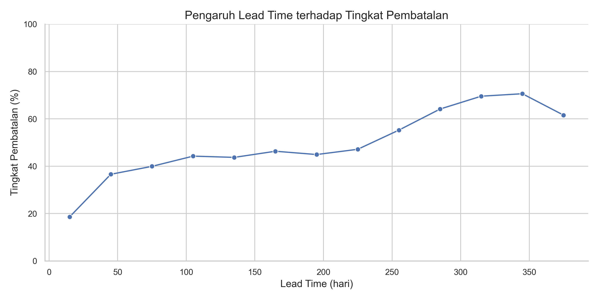
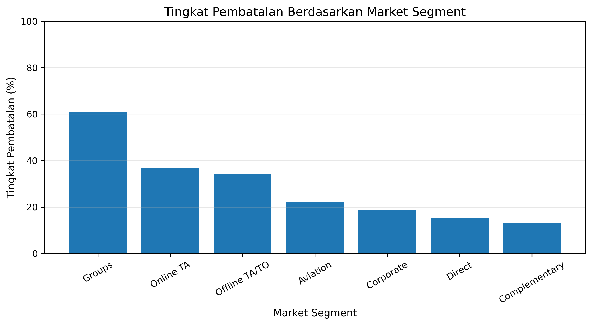
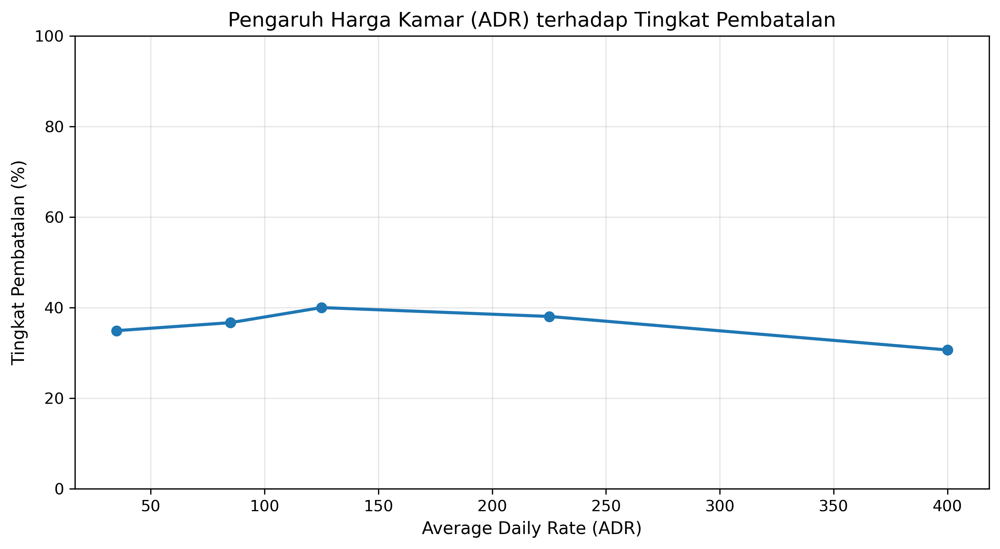

# 
 Analisis Pembatalan Pemesanan Hotel 

## Table of Contents
- [Pendahuluan](#pendahuluan)
- [Nilai Bisnis](#nilai-bisnis)
- [Dataset](#dataset)
- [Pertanyaan Bisnis](#pertanyaan-bisnis)
- [Package yang Diperlukan](#package-yang-diperlukan)
- [Data Preparation](#data-preparation)
- [Eksplorasi dan Analisis Data](#eksplorasi-dan-analisis-data)
  - [Pengaruh Lead Time terhadap Pembatalan](#pengaruh-lead-time-terhadap-pembatalan)
  - [Pembatalan Berdasarkan Market Segment](#pembatalan-berdasarkan-market-segment)
  - [Pengaruh Harga Kamar (ADR) terhadap Pembatalan](#pengaruh-harga-kamar-adr-terhadap-pembatalan)
- [Wawasan Utama](#wawasan-utama)
- [Rangkuman](#rangkuman)
- [Penulis](#penulis)

---

## Pendahuluan
Pembatalan pemesanan hotel merupakan tantangan utama dalam industri perhotelan karena
menyebabkan ketidakpastian pendapatan dan inefisiensi perencanaan operasional.
Proyek ini bertujuan untuk menganalisis data historis pemesanan hotel
guna mengidentifikasi faktor-faktor yang berkaitan dengan tingginya tingkat pembatalan reservasi.

Analisis difokuskan pada karakteristik pemesanan dan perilaku pelanggan
yang relevan untuk mendukung pengambilan keputusan berbasis data
oleh manajemen hotel.

---

## Nilai Bisnis
Analisis ini memberikan nilai bagi manajemen hotel dengan:
- Mengidentifikasi faktor risiko pembatalan pemesanan
- Meningkatkan stabilitas pendapatan melalui kebijakan reservasi yang lebih tepat
- Menyesuaikan strategi harga dan channel pemesanan
- Mengoptimalkan kebijakan deposit dan konfirmasi pemesanan

---

## Dataset
- **Sumber**: Hotel Booking Demand Dataset (Antonio, Almeida, & Nunes, 2019)
- **Periode data**: 2015–2017
- **Jumlah data**: ±119.000 baris
- **Variabel utama**:
  - `is_canceled`
  - `lead_time`
  - `market_segment`
  - `adr` (Average Daily Rate)
  - `arrival_date_year`
  - `arrival_date_month`

---

## Pertanyaan Bisnis
Analisis ini dirancang untuk menjawab pertanyaan berikut:
1. Faktor apa saja yang berkaitan dengan tingginya tingkat pembatalan pemesanan hotel?
2. Apakah jarak waktu antara pemesanan dan hari kedatangan (*lead time*) mempengaruhi kemungkinan pembatalan?
3. Bagaimana pengaruh *market segment* terhadap tingkat pembatalan pemesanan?
4. Apakah tingkat harga kamar (*Average Daily Rate / ADR*) berkaitan dengan pembatalan reservasi?

---

## Package yang Diperlukan
Analisis dilakukan menggunakan lingkungan Python dengan package berikut:
- Python 3.10
- Pandas
- Matplotlib
- Scikit-learn
- Jupyter Notebook

Seluruh dependency dapat diinstal melalui file `requirements.txt`.

---

## Data Preparation
Tahapan persiapan data meliputi:
- Penghapusan nilai tidak valid (ADR ≤ 0)
- Penanganan *outlier* ekstrem untuk menjaga stabilitas analisis
- Penyesuaian tipe data
- Penyiapan variabel untuk analisis eksploratif

Data yang telah diproses digunakan secara konsisten
pada seluruh tahap analisis berikutnya.

---

## Eksplorasi dan Analisis Data

### Pengaruh Lead Time terhadap Pembatalan

Analisis menunjukkan bahwa semakin panjang *lead time*,
semakin tinggi tingkat pembatalan pemesanan.
Hal ini mencerminkan rendahnya tingkat komitmen
pada pemesanan yang dilakukan jauh hari.

---

### Pembatalan Berdasarkan Market Segment

Market segment **Groups** dan **Online TA**
memiliki tingkat pembatalan paling tinggi.
Temuan ini mengindikasikan perlunya kebijakan reservasi
dan deposit yang berbeda untuk masing-masing segmen.

---

### Pengaruh Harga Kamar (ADR) terhadap Pembatalan

Hubungan antara harga kamar dan pembatalan bersifat tidak linear.
Tingkat pembatalan tertinggi terjadi pada rentang harga menengah,
sementara segmen harga sangat tinggi menunjukkan tingkat pembatalan yang lebih rendah.

---

## Wawasan Utama
Berdasarkan hasil eksplorasi data:
- *Lead time* merupakan faktor paling konsisten dalam meningkatkan risiko pembatalan
- *Market segment* sangat mempengaruhi pola pembatalan pemesanan
- Hubungan antara ADR dan pembatalan tidak bersifat linear,
  mencerminkan perbedaan perilaku pelanggan antar segmen harga

---

## Rangkuman
Analisis ini menunjukkan bahwa pembatalan pemesanan hotel
dipengaruhi oleh karakteristik pemesanan dan perilaku pelanggan,
bukan terjadi secara acak.
Dengan memahami pola-pola tersebut,
manajemen hotel dapat menyusun strategi reservasi
yang lebih efektif dan berbasis data.

---

## Penulis
**Muhammad Luthfi**  
S1 Teknik Informatika – Universitas Muhammadiyah Malang
